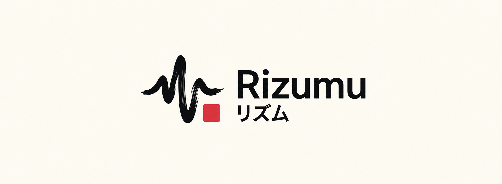

 
 

### Your music, wherever it lives.

 

[**Download**](#download) · [**Features**](#features) · [**Contributing**](#contributing) · [**Support**](#support) · [**Disclaimer**](#disclaimer)

 

> [!IMPORTANT]
> Rizumu is not affiliated with, endorsed by, or connected to YouTube or Google in any way. Use it at your own discretion.

---

<h1>Features</h1>

<table>
  <tr>
    <td width="50%" valign="top">

#### Playback
- **Search, browse and play** anything available on YouTube Music.
- **Hi-Res lossless audio** — FLAC/ALAC from your own music server or a configured module source, with YouTube Music as fallback.
- **Gapless playback with true crossfade**, adjustable 0–12s.
- **Automix [Beta]** — DJ-style transitions with beat-matching and tempo-stretching.
- **Offline downloads** — save tracks with embedded metadata.
- **Local music library** integration.
- **Background playback** via a proper foreground media session.
- **Apple-like lyrics animation** — credit to [binimum](https://github.com/binimum/am-lyrics).

#### Experience
- **Animated album canvas** — motion artwork on the now-playing screen.
- **Word-synced lyrics** — word/syllable-level highlighting from multiple sources.
- **Dynamic, artwork-driven theming** — Material palette extracted from album art.
- **Frosted-glass UI** — Telegram-style translucent bars via Haze, Material 3 theming.

    </td>
    <td width="50%" valign="top">

#### Connectivity & Accounts
- **Sign in with your Google account** for personalized content.
- **Discord Rich Presence** — in-app login, live track/artist/album and progress.
- **Scrobbling** to Last.fm and ListenBrainz.
- **Your own music server** — Navidrome, Airsonic, Gonic and other Subsonic-compatible servers: search, browse, playlists, scrobbling and lyrics from your own library. See [docs/SUBSONIC.md](docs/SUBSONIC.md).
- **Choose your library** — the first run asks whether Rizumu is built around YouTube Music or your own server; switch any time in Settings. Server mode keeps YouTube as a fallback for what the server doesn't hold, with no Google account in the UI.
- **Pluggable sources** — add, edit, test and health-check module sources.

#### Controls & Tweaks
- **Per-network audio quality** — separate quality ceilings for Wi-Fi and mobile data.
- **Playback speed control** (0.5×–2.0×) and **skip silence**.
- **Sleep timer** — fixed presets or "stop after this track".
- **System equalizer** integration.
- **Stats for nerds** — codec, bit depth, sample rate, and more on the now-playing screen.

    </td>
  </tr>
</table>

---

<h1>Download</h1>

Grab the latest signed APK from the [Releases](https://github.com/Sidharth-Singh10/Rizumu/releases) page. Sideloading requires enabling "Install unknown apps" for whichever app you download it with.

---

<h1>Contributing</h1>

We welcome contributions to Rizumu! When submitting a Pull Request, please ensure you make your PR against the **`latest`** branch, not the `main` branch.

---

<h1>Disclaimer & Legal Notice</h1>

Rizumu is an independent, community-driven third-party audio player and client. It is **not** associated with Google LLC, YouTube Music, Deezer, Telegram, or any of their parent companies.

* **No Media Hosting:** Rizumu does not host, upload, or store copyrighted music files. It operates strictly as an interface to scan local device storage or stream media directly from public, public-facing, or user-authenticated APIs.
* **Fair Use & API Usage:** This software is created solely for personal research, educational, and fair-use purposes. The user is entirely responsible for ensuring their usage aligns with their local copyright laws and YouTube Terms of Service.
* **No Ad-Blocking Guarantee:** While Rizumu focuses on providing a clean listening environment, it does not guarantee permanent bypasses or modifications to commercial third-party platform conditions.
* **Copyleft:** Rizumu is free software under the GPLv3. The license does not let anyone forbid others from selling or redistributing copies, but any distribution must come with the Corresponding Source under the same license.

---

<h1>License</h1>

This project is licensed under the **GNU General Public License v3.0 (GPLv3)**. See the [LICENSE](LICENSE) file for details.

---

<h1>Credits</h1>

This project is a fork of **[BitChord](https://github.com/kushagrasinghx/BitChord)** by
[Kushagra Singh](https://github.com/kushagrasinghx) — the original Android YouTube
Music client it is built on. The app, its design, its playback engine, its sources
layer and its documentation are his work.

What this fork adds on top: native Subsonic/OpenSubsonic server support
(Navidrome, Airsonic, Gonic, Ampache, Jellyfin) and the primary-library mode that
builds the app around your own server, with YouTube Music as the fallback.

Upstream source: <https://github.com/kushagrasinghx/BitChord>

